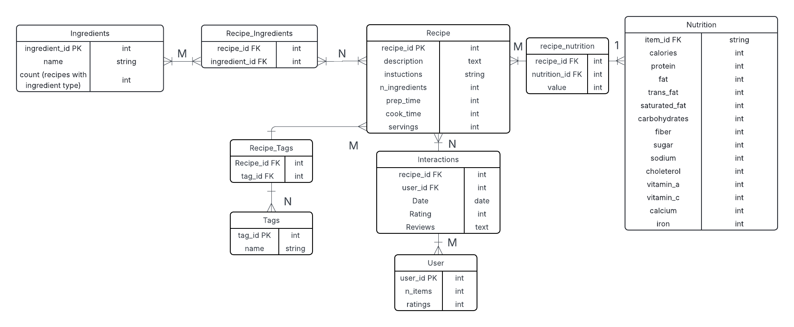

# RecipeDB

**A MySQL database** for tracking recipes, nutrition, ingredients, and interactions.

# Contents
- 'SchemaAndData.sql' - SQL dump of schema + sample data
- 'ERDiagram.png' - ER diagram
- 'SampleQuieries.sql' - CRUD exampels

# Data Recources
- 'https://www.kaggle.com/datasets/shuyangli94/food-com-recipes-and-user-interactions/data?select=RAW_recipes.csv' - Recipes and data
- 'https://lucid.app/pricing/lucidchart?referer=https%3A%2F%2Flucid.app%2Fusers%2Flogin#/pricing/chart' - Lucid Chart ER Diagram Builder
