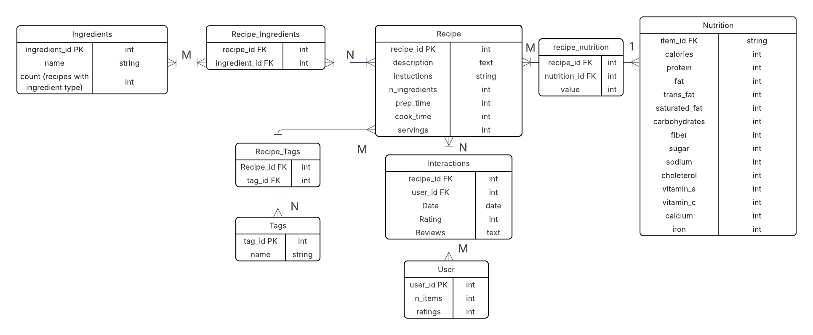

# RecipeDB

**A MySQL database** for tracking recipes, nutrition, ingredients, and interactions.

What I Learned: Relational Databse Design, SQL, and Data Managment
  - This project involved designing and implementing a relational database in MySQL to store
    recipes, ingredients, nutrition facts, and user interactions. Building this database provided
    hands-on experience with schema design, normalization, and querying large datasets.

Key Skills Developed:
  - Designing entity-relationship (ER) models.
  - Implementing primary keys, foreign keys, and joins to enforce data congrouency.
  - Writing SQL queries for Create, Remove, Update, and Delete (CRUD) opperations.
  - Cleaning and mapping real-world datasets to the database schema.

# Contents
- 'SchemaAndData.sql' - SQL dump of schema + sample data
- 'ERDiagram.png' - ER diagram
- 'SampleQuieries.sql' - CRUD exampels

# Data Recources
- 'https://www.kaggle.com/datasets/shuyangli94/food-com-recipes-and-user-interactions/data?select=RAW_recipes.csv' - Recipes and data
- 'https://lucid.app/pricing/lucidchart?referer=https%3A%2F%2Flucid.app%2Fusers%2Flogin#/pricing/chart' - Lucid Chart ER Diagram Builder
